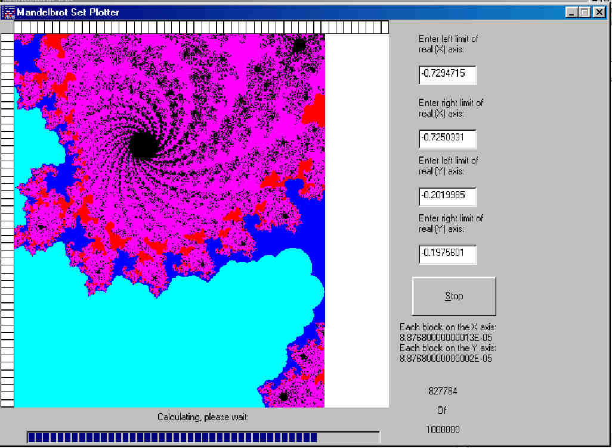



## Mandelbrot Set Plotter

### Description

This nice little program illustrates the wonders of the famous Mandelbrot Set. It's very flexible, including features like magnifying to a selected region, saving and loading previously calculated sets, indicators for where the mouse pointer is pointing to, etc. etc.

A readme file is included, and contains the full explanation of the program, as well as an explanation about complex numbers and the Mandelbrot Set, so that even people who have never heard of such things can enjoy this mathematical wonder.

Enjoy! And if you like it, I'd really appreciate it if you'd vote for it :)
 
### More Info
 

             |
---                |---
**Submitted On**   |2002-09-02 21:39:00
**By**             |[Daniel Mayerson](https://github.com/Planet-Source-Code/PSCIndex/blob/master/ByAuthor/daniel-mayerson.md)
**Level**          |Intermediate
**User Rating**    |4.8 (19 globes from 4 users)
**Compatibility**  |VB 6\.0
**Category**       |[Math/ Dates](https://github.com/Planet-Source-Code/PSCIndex/blob/master/ByCategory/math-dates__1-37.md)
**World**          |[Visual Basic](https://github.com/Planet-Source-Code/PSCIndex/blob/master/ByWorld/visual-basic.md)
**Archive File**   |[Mandelbrot126138932002\.zip](https://github.com/Planet-Source-Code/daniel-mayerson-mandelbrot-set-plotter__1-38632/archive/master.zip)

